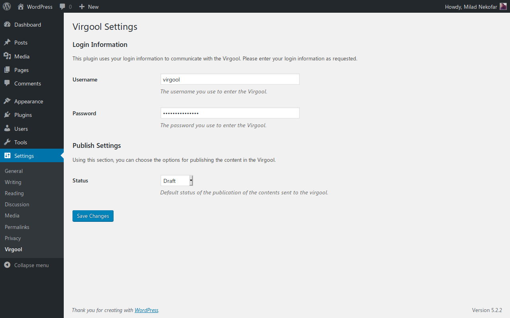

# Virgool
<!-- only:wp>
Contributors: nekofar  
Donate link: http://milad.nekofar.com/  
Tags: virgool, publish, persian  
Requires at least: 4.7.0  
Tested up to: 5.2.2  
Requires PHP: 5.6.4  
Stable tag: 1.0.0  
License: GPL-2.0+  
License URI: http://www.gnu.org/licenses/gpl-2.0.html
<only:wp -->

<!-- only:github/ -->

<!-- /only:github -->

Publish posts automatically to a Virgool profile.

## Description

Virgool lets you publish posts automatically to a [Virgool](https://virgool.io) profile.

## Collaboration

You can send your pull request at [GitHub](https://github.com/nekofar/virgool)

## Installation

1. Extract `virgool.zip` to the `/wp-content/plugins/` directory
2. Activate the plugin through the 'Plugins' menu in WordPress
3. Fill out username and password of your Virgool profile on the settings page.

## Screenshots

<!-- only:github/ -->

<!-- /only:github -->

<!-- only:wp>
1. Virgool options under Settings.
<only:wp -->

## Changelog

### 1.0.0
* Initial release.
